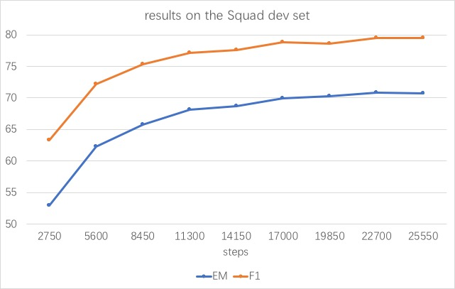

## Reinforced Mnemonic Reader in tensorflow
RMR: https://arxiv.org/abs/1705.02798

## Pipline
1. Run the ``preprocess.ipynb`` to get the input datasets.
2. Run ``train.py`` to start training.
3. Run ``train_finetune.py`` to train the model with the reinforcement loss.
4. Run ``test.py`` to start testing.

### notes
1. `conv1d` in `tensor2tensor` is used to instead of the matrix matmul (full connection) operation in RMR model.
2. Welcome to discuss any problem about this project (especially the RL loss).
3. The reinforcement loss should be used after the convergence of cross-entropy.

## Updates
- [x] Init for the RMR model (without dynamic-critical reinforcement learning DCRL)
- [x] Add the self-critical sequence training (SCST) (no test)

## Results
Result on dev set of squad

EM:70.82% F1:79.51% (22700 steps without RL_loss)